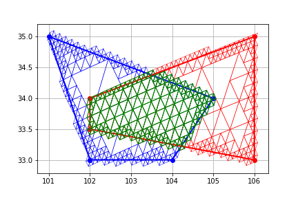
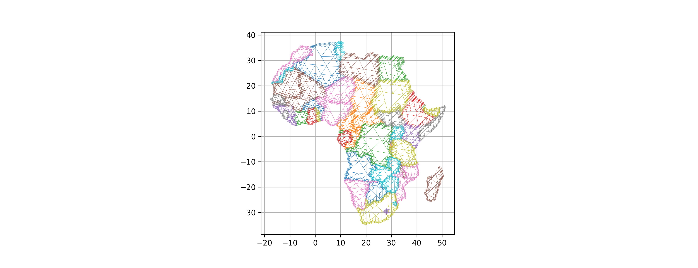
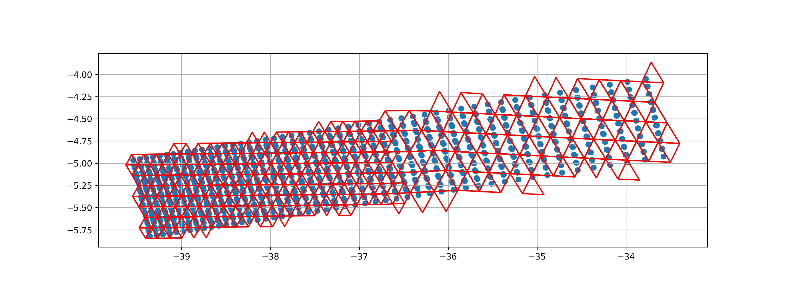

# STAREPandas
STAREpandas adds [SpatioTemporal Adaptive Resolution Encoding
(STARE)](https://github.com/SpatioTemporal) support to [pandas DataFrames](https://pandas.pydata.org/).



## Introduction
STAREPandas provides high-level functions for users to explore and interact with STARE.

STAREPandas is the STARE pendant to [GeoPandas](https://geopandas.org/). It makes working with geospatial data in python easier. It provides file and database I/O functionality and allows to easily perform STARE based spatial operations that would otherwise require a (STARE-extended) spatial database or a geographic information system. 

In STAREDataFrames, geometries are represented as sets of STARE triangles or ”trixels”; analogously to GeoPandas geodataframes which represent geometries as WKT. In STARE dataframes, points are represented as STARE trixels at the HTM tree’s leaf level. Polygons are represented as sets of STARE trixels that cover the polygon. 

STAREPandas also extends the geopandas file I/O functionality to load some (raster) formats of remote sensing granules and tiles (MOD09, MOD09GA, VNP03) through pyhdf and netcdf4.


## Installation
STAREPandas is built on top of [pystare](https://github.com/SpatioTemporal/pystare), which is not on PyPI yet. Therefore manually install pystare first.

```shell
mkvirtualenv --python=/usr/bin/python3 $STAREPANDAS_ENV
pip3 install git+git://github.com/SpatioTemporal/pystare.git
```

Then install STAREPandas from github

```shell
pip3 install git+git://github.com/NiklasPhabian/starepandas.git $STAREPandas
```

or from a local copy

```shell
git clone https://github.com/NiklasPhabian/starepandas $STAREPandas
pip3 install $STAREPandas
```
    
## Note
Some of the examples require Rtree-linux to be installed to run geopandas spatial joins. As of 2020-08-20, I could not make this work on Centos7 with rtree>0.9 (9.4) as it requires GLIBCXX_3.4.21. I therefor downgrade rtree to rtree-0.8.3 on Centos7 

    pip3 install "rtree>=0.8,<0.9
    
This is likely related to [rtree issue 120](https://github.com/Toblerity/rtree/issues/120)

    
## Features and usage
The examples/ folder contains notebooks that highlight the usage.

STAREPandas helps integrating STARE in the geospatial data workflow.
Building on top of fiona and geopandas, STAREPandas allows to read almost any vector-based spatial data format and convert lat/lon and well-known-text (WKT) representation to STARE indices and covers.
   
```python
path = geopandas.datasets.get_path('naturalearth_lowres')
world = geopandas.read_file(path)
africa = world[world.continent=='Africa']
stare = starepandas.stare_from_gdf(africa , level=7, force_ccw=True)
africa  = starepandas.STAREDataFrame(africa , stare=stare)
```
    
STAREPandas extends the geopandas rich plotting abilities and provides a simple method to generate visualizations of trixels:

```python
trixels = africa.trixels()
africa.set_trixels(trixels, inplace=True)
africa.plot(ax=ax, trixels=True, boundary=True, column='name', linewidth=0.2)
```
    


STAREPandas extends the file I/O capability with the ability to read common remote-sensing granule data from HDF and netCDF files. STARE indices for the granules can either be generated on demand or read from a companion / sidedcar file.
    
```python
path= 'data/MYD05_L2.A2020060.1635.061.2020061153519.hdf'
modis = starepandas.read_mod09(path, add_stare=True, adapt_resolution=True)
```



STAREPandas allows to carry out STARE-based spatial relation tests and spatial joins.
    
```python
cities = [  'Buenos Aires', 'Brasilia', 'Santiago', 
            'Bogota', 'Caracas', 'Sao Paulo', 'Bridgetown']
latitudes = [-34.58, -15.78, -33.45, 4.60, 10.48, -23.55, 13.1]
longitudes = [-58.66, -47.91, -70.66, -74.08, -66.86, -46.63, -59.62]
data =  {   'City': cities, 
            'Latitude': latitudes, 'Longitude': longitudes}
cities = starepandas.STAREDataFrame(data)
stare = starepandas.stare_from_xy(cities.Longitude, cities.Latitude, level=27)
cities.set_stare(stare, inplace=True)
    
countries = geopandas.read_file(geopandas.datasets.get_path('naturalearth_lowres'))
countries = countries.sort_values(by='name')
samerica = countries[countries.continent=='South America']
stare = starepandas.stare_from_gdf(samerica, level=10, force_ccw=True)
samerica = starepandas.STAREDataFrame(samerica, stare=stare)
    
starepandas.stare_join(samerica, cities, how='left').head()
```


STAREPandas further allows for STARE-bases intersections:

```python
fname = 'zip://data/amapoly_ivb.zip'
amazon = geopandas.read_file(fname) # Nice flex
amazon = amazon.to_crs('EPSG:4326')
    
stare = starepandas.stare_from_gdf(amazon, level=10, force_ccw=True)
amazon = starepandas.STAREDataFrame(amazon, stare=stare)

stare_amazon = samerica.stare_intersection(amazon.stare.iloc[0])
```
    
    


